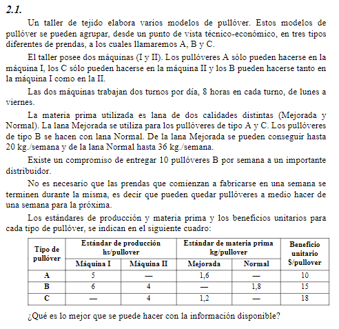

## Analisis 
Se trata de un problema de ***produccion***, donde se producen pulloveres de diversos tipos teniendo en cuenta la materia prima necesaria para producir y las cantidad de horas disponibles que tenemos

> Los problemas de ***produccion*** se ocupan de la planificación y optimización de los procesos de producción. Estos problemas pueden incluir aspectos como la asignación de recursos, la programación de la producción y la mezcla de ingredientes (que es donde se conecta con los problemas de mezcla).

## <br> Objetivo
- **Que hacer**: Determinar la cantidad de pullovers a fabricar y vender
- **En cuanto**: En una semana
- **Para que**: Maximizar la ganancia

## <br> Supuestos
- Todo lo que se produce se vende
- No hay perdida de recursos
- No hay stock inicial
- La venta de pulloveres en una semana puede ser fraccionada (variables continuas) 
- Tengo suficiente mano de obra, capital
- Los gastos de energia estan cubiertos externamente
- Calidades indistinguibles - Las calidades de las prendas B generadas en la ambas maquians son iguales
- No hay fallas de produccion
- El cambio de tipo de lana para producir otro pullover no pierdo tiempo o ese tiempo esta incluido en el tiempo de produccion del pullover

## <br> Consideraciones
Aunque tengo 2 maquinas que hacen un mismo producto (indistinguible), tengo que crear variables que haga referencia de donde viene cada uno => $B_{M1}, B_{M2}$

## <br> Variables
> Variables de decision para ***produccion***: Cantidades de productos a producir 

- $A_{M1}, B_{M1}, B_{M2}, C_{M2}$ (continuas): Cantidad de pullovers producido por cada maquina $\frac{pullovers}{semana}$

## <br> Funcion objetivo
La idea es maximizar la ganancia por la produccion de productos
 $$ Max(Z) = \frac{10\$}{pullóver} A_{M1} + \frac{15\$}{pullóver} B_{M1} + \frac{15\$}{pullóver} B_{M2} + \frac{18\$}{pullóver} C_{M2} $$

## <br> Restricciones
> Restricciones para ***produccion***: Pueden incluir restricciones de capacidad, demanda, etc.
- Se necesitan producir al menos 10 pulloveres B por semana: $B = B_{m1} + B_{M2} \ge  10 \frac{pulloveres}{semana}$

### Limite de recursos:
> Tengo que igualar el periodo en todas las variables que tengan produccion/stock/capacidad por periodo

>Como cada maquina trabaja en 2 turnos de 8 horas por dia, durante los 5 dias de la semana, entonces trabajan: $2 * 8* 5 = 80 \frac{hs}{semana}$

- **Lana mejorada**: $L_{M} = 1.6\frac{kg}{pullover} L_{MA} + 1.6\frac{kg}{pullover} L_{MB} + 1.2\frac{kg}{pullover} L_{MC} \le 20 \frac{kg}{semana}$

- **Lana normal**: $L_{N} = 1.8\frac{kg}{pullover} L_{NB} \le 36 \frac{kg}{semana} $

- **Capacidad Productiva Maquina 1**: $M1 = 5 \frac{hs}{pullover} A_{M1} + 6\frac{hs}{pullover} B_{M1} \le 80 \frac{hs}{semana}$

- **Capacidad Productiva Maquina 2**: $M2 = 4 \frac{hs}{pullover}B_{M2} + 4\frac{hs}{pullover} C_{M2} \le 80 \frac{hs}{semana}$

## <br> Resolucion por software - LINDO
Como tengo todo en funcion de la cantidad de productos por cada maquina, calculo la funcion objetivo

```
MAX 10 AM1 + 15 BM1 + 15 BM2 + 18 CM2
ST
B) BM1 + BM2 >= 10
LM) 1.6 AM1 + 1.2 CM2 <= 20
LN) 1.8 BM1 + 1.8 BM2 <= 36
M1) 5 AM1 + 6 BM1 <= 80
M2) 4 BM1 + 4 CM2 <= 80
END
```

## Resultado
```
Model: Ejercicio 2.1
* Production model solved with objective: 550
* Total benefit=550
Production of A: 0.000
Production of B1: 13.333
Production of B2: 3.333
Production of C: 16.667
```

Se logro la maximizacion en $MAX(z) = 550$

Como suponiamos que se podrian vender pulloveres de forma fraccionada
vemos que se lograron producir y vender:

### Pulloveres:
- A: 0
- B: 16,666
- C: 16,667
### Produccion:
- Maquina 1: 13,333 pulloveres
- Maquina 2: 20,000 pulloveres
