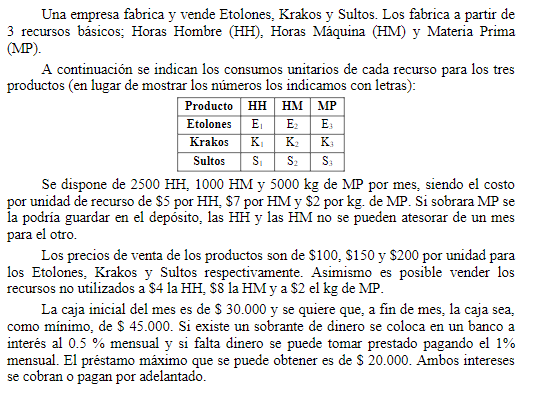

## Analisis

Problema de planificacion de produccion
Una empresa fabrica 3 productos a partir de 3 recursos basicos, donde cada producto tiene consumos unitarios de cada recurso.
Se dispone una disponibilidad por mes de recursos. Ademas cada recurso tiene un costo por uso.
Se puede almacenar en el deposito MP pero HH y HM no puede guardarse mas.
Tambien es posible vender recursos no utilizados (en el caso de hm tienen que venderse el mismo mas)
Se quiere lograr un increment ode capital de minimo 45.000$ por mes.
Existe como recurso colocar el dinero en un banco y obtener ganancias de 0.5% mensual
O tambien se puede pedir prestamos de 20000$ pagando 1% mensual.

##   Objetivo
- **Que hacer**: Determinar la cantidad de unidades de productos a realizar
- **En cuanto**: en un mes 
> ✋🏻 Pero en verdad necesito esto para analizarlo en el tiempo 
- **Para que**: maximizar ganancias
>Ganancias = ingresos - egresos

##   Supuestos
- Se cuenta con mano de obra suficiente
- Los recursos no tienen defectos
- Los productos creados no tienen fallos
- No hay stock inicial
- Se puede fabricar cantidades pequeñas de producto
- Todo lo que esta para la venta, se vende
- No falla ni desperdicios en la produccion
- Los precios son fijos, la tasa de interes es fija
- No hay limitaciones fisicas en la produccion y en el almacenamiento
- No hay inflacion
  > Habria que poner un supuesto que mencione la disposicion de los recuros
  > - podria decir que ya lo tengo, que no pago nada
  > - (elegi esta) podria decir que solo compro lo que necesito, libre interpretacion

##   Variables
$$i = recurso = {H, M, P} , j = producto = {E, K, S}$$

- $P_p$ = cantidad del producto p producido
- $R_{cj}$ = cantidad recuso j comprado
- $R_{sj}$ = cantidad de recurso j en stock
- $R_{uj}$ = cantidad de recurso j utilizado

- $D$ = (Defecto) Prestamos pedido el proximo mes
- $E$ = (Exceso) Interes ganado el proximo mes
- $C_i$ = dinero en caja inicial
- $C_f$ = dinero en caja final

##   Funcion Objetivo
> Aca van las ganancias y los costos
> ademas deberia agregar si se tomo un prestamo.
$$Max(Z) = \frac{100\$}{uni} P_E + \frac{150\$}{uni} P_K + \frac{200\$}{uni} P_S - \frac{5\$}{hh} R_{cH} - \frac{7\$}{hM} R_{cM} - \frac{2\$}{kg} R_{cP} + \frac{4\$}{uni} R_{sH} + \frac{8\$}{uni} R_{sM} + \frac{2\$}{uni}  R_{sP} + 1.5 I - 0.01 P $$

##   Restricciones

### Recursos:
#### Compra
  - $R_H \le 2500$
  - $R_M \le 1000$
  - $R_P \le 5000$
<<<<<<< HEAD
- 
#### Produccion
  - $R_H = R_{EHH} + R_{KHH} + R_{SHH}$
  - $R_M = E2 + K2 + S2$
  - $R_P = E3 + K3 + S3$

### Cantidades
  - $R_{EHH} = P_E E_1$ , $R_{KHH} = P_K K_1$ , $R_{SHH} = P_S S_1$ 
  - $R_{EHM} = P_E E_2$ , $R_{KHM} = P_K K_2$ , $R_{SHM} = P_S S_2$ 
  - $R_{EMP} = P_E E_3$ , $R_{KMP} = P_K K_3$ , $R_{SMP} = P_S S_3$ 
---
  - $R_{cHH} = R_{EHH} + R_{KHH} + R_{SHH}
  - $R_{cHM} = R_{EHM} + R_{KHM} + R_{SHM}
  - $R_{cMP} = R_{EMP} + R_{KMP} + R_{SMP}
=======

#### Produccion
> ❓dudas
  - $R_H = E_1 + K_1 + S_1$
  - $R_M = E_2 + K_2 + S_2$
  - $R_H = E_3 + K_3 + S_3$
>>>>>>> 8e8dd12acc524e3dc15d0f6dd82863ede2ec52e4

### Prestamo
  - $D \le 20.000$

### Caja 
  - $C_i = 30.000$
  - $C_f \ge 45.000$
<<<<<<< HEAD
  - $C_i + VENTAS - GASTOS = C_f + E - D$
=======
> $C_f$ es la diferencia entre costo y ganancias por venta
  - $C_f = \frac{100}{uni} P_E + \frac{150}{uni} P_K + \frac{200}{uni} P_S - \frac{5}{hh} R_{cH} - \frac{7}{hM} R_{cM} - \frac{2}{kg} R_{cP}$

>>>>>>> 8e8dd12acc524e3dc15d0f6dd82863ede2ec52e4

### Ventas:
- $VENTAS = \frac{100}{uni} P_E + \frac{150}{uni} P_K + \frac{200}{uni} P_S$
  
- $GASTOS = \frac{5}{hh} R_{cH} + \frac{7}{hM} R_{cM} + \frac{2}{kg} R_{cP}$

##   Resolucion por software

