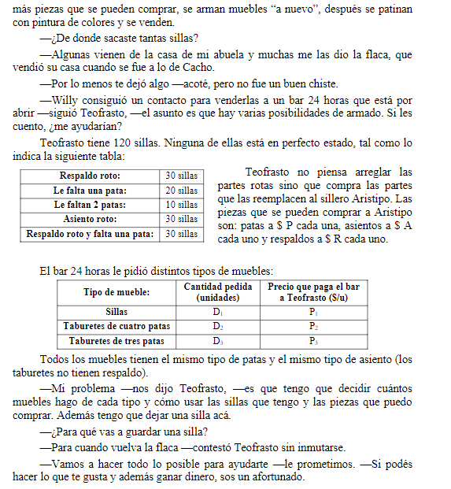

## Analisis

##   Objetivo
- **Que hacer**: Cuantos muebles hacer de cada tipo
- **En cuanto**: un tiempo determinado P
- **Para que**: Maximizar costos

##   Supuestos
- Las sillas tienen 4 patas
- Las sillas al repararlas mantienen la calidad
-
-

##   Variables
- $C_i$ compras del recurso i = {P, A, R}
- $S$ cantidad de sillas producidas
- $T$ cantidad de taburetes de 4 patas producidos
- $T3$ cantidad de taburetes de 3 patas producidos
> Deberia agregar la cantidad de P, A, R que quedan sin utilizar -> o ver algun supuesto

#### Produccion
- $P_S$ Patas usadas para sillas
- $P_T$ Patas usadas para taburete de 4 patas
- $P_{T3}$ Patas usadas para taburete de 3 patas

##   Constantes a determinar
#### Precio recursos
- $\$P$ precio de patas de asiento
- $\$A$ precio asiento
- $\$R$ precio de respaldo
#### Precio ventas
- $P_1$ precio de venta silla
- $P_2$ precio de venta taburete de cuatro patas
- $P_3$ precio de venta taburete de tres patas
#### Demanda
- $D_1$ cantidad pedida de silla
- $D_2$ cantidad pedida de taburete de cuatro patas
- $D_3$ cantidad pedida de taburete de tres patas

##   Funcion Objetivo
$$Max(Z) = P_1 D_1 + P_2 D_2 + P_3 D_3 - \$P C_P - \$A C_A - \$R C_R $$

##   Restricciones
### Sillas rotas
- $SiR = 120$: sillas rotas
- $Si_r = 30$: sillas sin respaldo
- $Si_{2p} = 10$: sillas sin 2 patas
- $Si_p = 20$: sillas sin una pata
- $Si_a = 30$: sillas sin asiento
- $Si_{rp} = 30$: sillas sin respaldo y sin 1 pata
- $SiF = 1$: sillas silla para la flaca

### Materiales
- $P = 390$ patas
- $A = 90$ asientos
- $R = = 60$ respaldos 
  
### Produccion
> si hay recursos sin utilizar podria agregarlo en una variable  
> tengo dudas sobre lasecuaciones, porque estoy diciendo que 1 pata es una silla blabla... arreglar
- $P + C_P = 4S + 4T + 3T3 = D_1 + D_2 + D_3$ 
- $A + C_A = 1S + T + T3 = D_2 + D_2 + D_3$
- $R + C_R = S = D_1$

### Demanda
- $D_1 = S$
- $D_2 = T$
- $D_3 = T3$

##   Resolucion por software