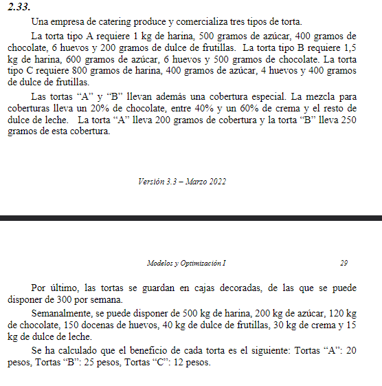

## Analisis
Es un problema de **armado**, se busca determinar cuantas tortas se van a tener que realizar, hay materia prima, hay una reseta que no esta definida, se busca obtener la reseta optima que haga maximizar ganancia. Se tiene que determinar el porcentaje de crema a utilizar.

##   Objetivo
- **Que hacer**: determinar cuantas tortas se van a producir
- **En cuanto**: en una semana
- **Para que**: maximizar ganancias

##   Supuestos
- Todo lo producido se vende
- No hay recursos en mal estado
- No hay inflacion
- Hay mano de obra suficiente
- El tiempo de produccion es despreciable
- Todas las tortan entran en las cajas
- Se pueden vender porciones pequeñas de tortas

##   Variables
- Tortas: $i$={${A,B,C}$}
- Ingredientes: $j$={${Az, Ch, Fr, Hu, Ha, Cr, Ddl}$}
- $T_i$: Cantidad de tortas $i$ producidas
- $P_i$: Precio de venta de la torta $i$
- $I_j$: Cantidad de ingrediente $j$ utilizado
- $C$: Cantidad e cajas decoradas utilizadas

##   Datos
- $P_A = 20$$
- $P_B = 25$$
- $P_C = 12$$

##   Funcion Objetivo
$$Max(Z) = P_A * T_A + P_B*T_B + P_C*T_C$$

##   Restricciones

### Recursos
- Cajas: $C \le 300$
- Azucar: $I_{Az} \le 200$
- Chocolate: $I_{Ch} \le 120$
- Harina: $I_{Ha} \le 500$
- Huevos: $I_{Hu} \le 150$ (**DOCENAS**)
- Frutilla: $I_{Fr} \le 40$
- Crema: $I_{Cr} \le 30$
- Dulce de leche $I_{Ddl} \le 15$

### Produccion
- Tortas y cajas: $C \le T_A + T_B + T_C$
- 

##   Resolucion por software