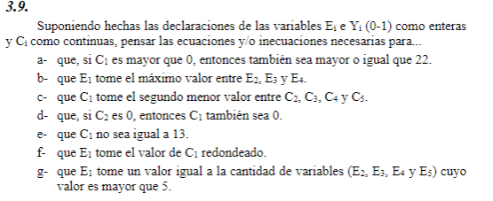

# A)
> Si $C_1 \gt 0$, entonces $C_1 \ge 22$

Defino:
$$
    Y_1 = 
    \begin{cases}
        1 && \text{si} && X_1>0 \\
        0 && \text{sino}
    \end{cases}
$$

Estoy diciendo que si $X_1$ entonces tengo una variable que me va a funcionar para activar una condicion

###   Problamos:
$$ 22 Y_1 \le C_1 \le M Y_1 $$
- Si $Y_1 = 0$ entonces queda $0 \le C_1 \le 0$ -> $C_1 = 0$
- Si $Y_1 = 1$ entonces queda $22 \le C_1 \le M$ -> esta raro

 
 

$$ 22 Y_1 \ge C_1 \ge M Y_1 $$
- Si $Y_1 = 0$ entonces queda $0 \ge C_1 \ge 0$ -> me obliga a que $C_1$ sea 0, no menor. Y esta bien, porque una variable entera no puede ser negativa y tampoco puede tomar valores intermedios de 0 y 22.
- Si $Y_1 = 1$ entonces queda $22 \ge C_1 \ge M$

#   B)
> que $E_1$ tome el valor maximo entre $E_2, E_3$ y $E_4$

Voy a tener una variable de desicion por cada uno
$Y_i$ con i={2,3,4}, indicativa que me dice si el $E_i$ es el maximo

$$ 
    Y_i =
        \begin{cases}
            1 && \text{si} && E_i > E_j \land E_i > E_k \\
            0 && \text{sino}
        \end{cases}
$$
 

> como una sola tiene que sobrevivir tengo que poner la condicion de que la suma de uno solo
$$Y_2 + Y_3 + Y_4 = 1$$
 

> Ahora tengo restringir a $E_1$ con cada variable para se iguale cuando se cumpla la condicion

$$ Y_2 E_2 \le E_1 \le E_2 + M(1-Y_2) $$ 
$$ Y_3 E_3 \le E_1 \le E_3 + M(1-Y_3) $$ 
$$ Y_4 E_4 \le E_1 \le E_4 + M(1-Y_4) $$

#   C
> $C_1$ tome el segundo menor valor de $C_2, C_3, C_4 y C_5$
Estas variables son continuas

$$ 
    X_i =
        \begin{cases}
            1 && \text{si} && C_i \text{ es el segundo menor valor del conjunto} \\
            0 && \text{sino}
        \end{cases}
$$

La condicion para que solo haya una sola de cada una encendida
$$Y_2 + Y_3 + Y_4 + Y_5 = 1$$
$$X_2 + X_3 + X_4 + X_5 = 1$$

Ahora relaciono $C_1$ con la $C_i$ que deseo

vamos a poner un ejemplo, $C_2 > C_3 > C_4 > C_5$, por ende $C_1 = C_4$

$$ X_4 C_4 \le C_1 \le C_4 X_4 + M(1-X_4)$$
> Aca quedaria $C_4 \le C_1 \le C_4$ obligando a $C_1$ ser $C_4$
 

$$X_2 C_2 \le C_1 \le C_2 X_2 + M(1-X_2)$$

> aca deberia pasar de que el lado izqueirdo tiene que quedar 0 y en el derecho algo muy grande $0 \le C_1 \le M$

#   D)
> Si $C_2 = 0$ entonces $C_1$ tambien es 0

$$
    Y_2 = 
        \begin{cases}
            0 && \text{si} && C_2 = 0 \\
            1 && \text{sino} 
        \end{cases}
$$ 

armo tabla de relaciones logicas
estas son continuas, asi que pueden ser cualuqier valor $\ge$ 0

 
C_1 C_2
0   0
x   1

$C2 $ 

$$ \boxed{ m \cdot Y_2 \le C_2 \le M \cdot Y_2 } $$ 
$$ \boxed{ C_1 \le M \cdot Y_2 } $$
