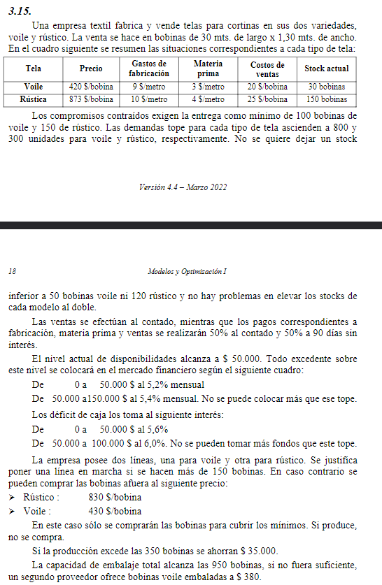

## Analisis

empresa textil fabrica y vende telas para cortinas voile y rustico
se venta bobinas de tela de 30mtsx1.30mts

las telas tienen precio/bobina, gastos de fabricacion/metro, precio de materia prima/metro, venta/bobina, stock inicial 

hay que cumplicar con una demanda minima de
- 100 bobinas de voile
- 150 bobinas de rustico

demanda maxima:
- 800 bobinas de voile
- 300 bobinas de rustico

stock minimo final 
- 50 bobinas de voile
- 120 bobinas de rustico

las ventas se efectuan al contado
los pagos correspondientes a fabricacion/materia prima/ venta se realizan 50% al contado y 50% a 90 dias sin interes -> lo peudo pagar en 3 meses

el nivel de disponibilidades alcanza a 50mil. todo excedente de este nivel se colocara en el mercado financiero

##   Objetivo
- **Que hacer**: determinar cuales y cuantas bobinas realizar 
- **En cuanto**: en un tiempo determinado (ej: un mes)
- **Para que**: para maximizar ganancias

##   Supuestos
- Todo lo que se maximiza es la ganancia de este mes, no importa los pagos que se realicen a 90 dias, no se toman en cuenta
- No hay deuda previa
- Todas las telas estan en buen estado
- Las cortinas estan en buen estado
- Todas las bobinas ya en stock ya estan embaladas
- No hay bobinas sin embalar
- El costo de fabricacion y materia prima hace mension a precio/metro (largo), el ancho de 1.3mts esta contemplado

##   Variables
- $i$ = {v, r}  v=voile, r=rusticas

Las siguientes variables son continuas:
- $V_i$: bobinas de tipo $i$ vendidas
- $Si_i$: stock inicial de bobinas de tipo $i$
- $Sf_i$: stock final de bobinas de tipo $i$
- $P_i$: cantidad de bobinas de tipo $i$ producidas
- $E_i$: cantidad de bobinas de tipo $i$ embaladas
- $C_i$: cantidad de bobinas de tipo $i$ compradas

### De estas salen:
- $P = P_v + P_r$: Cantidad de bobinas producidas
- $E = E_v + E_r$: Cantidad de bobinas embaladas
- $I_v$: Ingresos venta
  - $I_v = 420 V_v + 873 V_R$
- $G$: Gastos 
  - $G = (((9+3)\cdot 30) + 20) P_v + (((10+4) \cdot 10) + 25) P_r + 380 (P - E) + 430 C_v + 830 C_r$
- $Ex - Df$: Excedente y deficit
  - $I_v - G = Ex - Df$ 

### Variables Binarias
> Beneficio lo defino mas abajo
$$  Y_1 =
        \begin{cases}
            1 && \text{si} && 0 \ge Ex \ge 50.000 \\
            0 && \text{sino}
        \end{cases}$$
$$  Y_2 =
        \begin{cases}
            1 && \text{si} && 50.001 \ge Ex \ge 150.000 \\
            0 && \text{sino}
        \end{cases} $$

> importante, todas las variables son mayores a 0, por ende necesito crear una para los valores negativos y tratarla como positivo.

$$  Y_3 =
        \begin{cases}
            1 && \text{si} && 0 \ge Df \ge 50.000 \\
            0 && \text{sino}
        \end{cases} $$
$$  Y_4 =
        \begin{cases}
            1 && \text{si} && 50.001 \ge Df \ge 100.000 \\
            0 && \text{sino}
        \end{cases} $$

### Valores Iniciales
- Dinero Incial: $D_i = 50.000$
- Stock Incial:
  - $Si_v = 30$
  - $Si_r = 150$

##   Funcion Objetivo  

$$
Max(Z) = 
    420 V_v + 873 V_R 
    - 0.5( (((9+3)\cdot 30) + 20) P_v - (((10+4) \cdot 10) + 25) P_r )
    - 380 (P - E)
    - 430 C_v - 830 C_r
    + D_i
    - 0.056 (D_i + I_v - G) Y_3
    + 0.052 (D_i + I_v - G) Y_1
    - 0.060 (D_i + I_v - G) Y_4
    + 0.054 (D_i + I_v - G) Y_2
$$

##   Restricciones
#### Unidades
- $V_r + Sf_r = P_r + Si_r$ 
- $V_v + Sf_v = P_v + Si_v$ 

#### Almacenamiento
- $120 \ge Sf_r \ge 240$
- $50  \ge Sf_r \ge 100$

#### Demanda
- $150 \ge V_r \ge 300$
- $100 \ge V_v \ge 800$

#### Embalaje
- $E_v + E_r \le 950$

#### Financiacion
- $Y_1 + Y_2 + Y_3 + Y_4 = 1$
- $0 \le Ex \le 50.000 \cdot Y_1 + 150.000 \cdot Y_2$
- $0 \le Ex \le 50.001 \cdot Y_2$
- $0 \le Df \le 50.000 \cdot Y_3 + 100.000 \cdot Y_4$
- $0 \le Df \le 50.001 \cdot Y4$