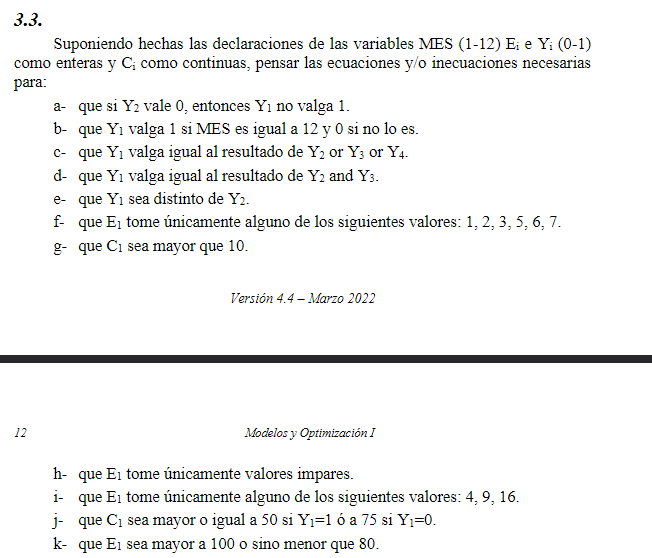

## Variables
- $i$={1,2, ... ,12}
- Mes (entero): 1-12) 
- $E_i$ bivariante del mes $i$
- $Y_i$ bivariante del mes $i$
- $C_i$ continua del mes $i$

##   A)
> Si $Y_2$ vale 0, entonces $Y_1$ no valga 1

> en otras palabras  
> $Y_1$ | $Y_2$      
> 0       0 (ok)     
> 0       1 (ok)     
> 1       1 (ok)     
> 1       0 (no puede pasar)  

en el mejor caso 1+1 = 2
en el peor caso 0+0 = 0
si 0+1 <= 2
si 1 + 0 <= 0 no se cumple 

$$Y_1 + Y_2 \leq 2Y_2$$
si resuelvo me queda
$$Y_1 \leq 2Y_2$$

El $Y_2$ del lado derecho que no se cumpla la igualdad cuando este es 0

##   B)
> $Y_1$ valga 1 si MES es igual a 12, y 0 sino lo es

$Y_1$ funciona como indicadora
$$
Y_2 = 
\begin{cases}
1 & \text{si} & MES=12 \\
0 & \text{sino}
\end{cases}
$$

deberiamos plantear la restriccion

> $MES$ | $Y_1$  
> 1     0 (ok)   
> 1     1 (no)   
> 2     0 (ok)   
> 2     1 (no)   
> ...            
> 12    1 (ok)   
> 12    0 (no)   

en otras palabras
> $Y_1 = 1$ si MES $=$ 12  
> $Y_1 \neq 1$ si MES $\neq$ 12

$$ 11Y_1 + 1 \leq MES \leq Y_1 + 11 $$
> del lado izquierdo, si y_1 es 1, no se da la igualdad, no se cumple  

##   C)
> Que $Y_1$ valga igual al resultado de $Y_2$ or $Y_3$ or $Y_4$.

$Y_1$ funciona como indicadora
$$
Y_1 = 
\begin{cases}
1 & \text{si} & Y_2 = 1 ∨ Y_3=1 ∨ Y_4=1 \\
0 & \text{sino}
\end{cases}
$$

Solo alcanza que alguna $Y_2, Y_3$ o $Y_4$ sea igual a 1 para exigir que $Y_1 = 1$
