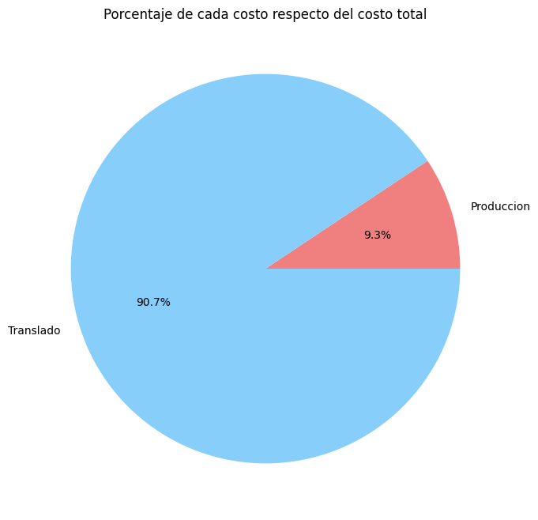
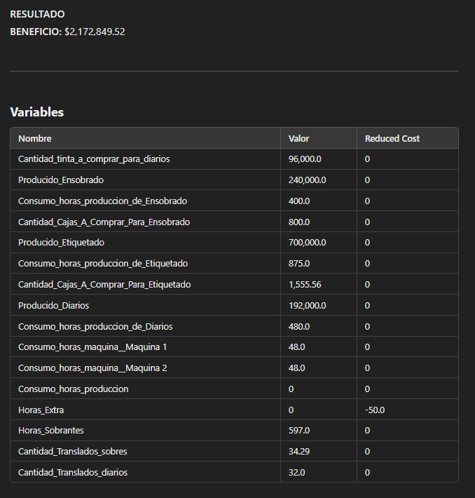

# Trabajo Final Modelos y Optimizacion I 
### Noviembre 2024
#### Integrantes
- Agustin Demicheli 
- Santiago Jorda
- Nahuel Godoy
- Estefano Polizi 

## 1. Papeleria Godoy SRL

La familia Godoy se dedica hace 30 años al rubro de la papelería,  cuenta con una fábrica en la que elaboran 2 productos, sobres y etiquetas,  la papelería contrató a X trabajadores, los cuales trabajan de lunes a sábados con turnos de 8 HS/DÍA, además cuenta con una máquina M1 que se dedica al doblado de las hojas. Esta cuenta con una disponibilidad de H horas máquina, para evitar de esta manera un costoso mantenimiento constantemente.
Los recursos se obtienen de dos fuentes, del cliente quien proveerá la materia prima para realizar el trabajo solicitado y además un mayorista de papel y cartón, el cual vende por lotes de 100 cajas a un costo de $C y 100 sobres por $S.
Cada persona dedicada a producir sobres demora HS en hacer 1500 sobres, y HE para hacer 2000 etiquetas. Por otro lado, las máquinas funcionan de manera mucho más eficiente demorando HM1 en hacer 10000 sobres Con lo indicado.
Se utilizan fletes para entregar los sobres terminados, cada encomienda puede transportar 7000 de los mismos, y este posee un precio de $CT
 ¿Qué sería lo mejor que puede hacer la familia Godoy?

## 2. Agregar Producto

La papelera Godoy quiere agregar a su producción la producción de diario personalizados. Se utilizará la máquina M1 para el doblado del papel, y deciden utilizar una vieja máquina de impresión M2 que tenían guardada. 
Por cada diario se utilizan ML mililitros de tinta. La tinta se compra en el mayorista por litro a un precio de $CTIN
El papel diario es brindado por los clientes.
Cada persona que hace el trabajo manual de doblar los diarios puede hacer CS por hora. La máquina 1 puede doblar hasta DD por hora y la máquina 2 puede trabajar 100 horas por mes. Necesita que un solo operador esté a cargo.
Los fletes pueden transportar hasta 4000 diarios al mismo precio de antes

## 3. Control de Calidad

La papalera enfrenta desafíos de calidad debido a defectos generados por el uso de maquinaria, lo que requiere un proceso adicional de reparación para mantener los estándares del producto.
Un porcentaje fijo de los sobres producidos por la máquina son rechazados debido a defectos y deben ser reparados, lo que genera costos adicionales en términos de tiempo y dinero $CR.

# Resultados caso base
## Analisis
## Hipotesis
## Variables
## Funcion Objetivo
## Restricciones
## Resultados

# Resultado segundo caso
## Analisis
## Hipotesis
## Variables
## Funcion Objetivo
## Restricciones
## Resultados

# Resultado tercer caso
## Analisis
Se agrega
## Hipotesis
## Variables
- $R_m$: Sobres rechazados por maquina
- $H_{rs}$: Horas invertidas en reparacion por maquina
## Constantes
- $C_{rs}$: Costo de reparacion sobre
- $PR_{M1}$: Porcentaje de rechazo
- $REP_{hr}$: Cantidad de reparacion por hora
## Restricciones
### Consumo Maquina
- Consumo: R_m = P_{A} * PR_{M1}
### Rechazo Maquinas
- Rechazo: $R_m = H_{rs} * REP_{hr}$
### Costos reparacion
- Costo reparacion: $C_{rep} = R_m * C_{rs}$
- Costo total: $C_{total} = C_{mp} + C_{he} + C_{co} + C_{tr} + C_{rs}$
## Resultados

